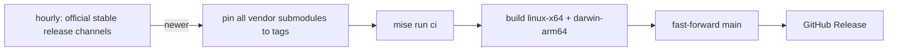

# oc-forge

Patched, jointly pinned releases of OpenCode, OpenChamber, and Orca.

The `vendors/` submodules are pinned to official stable release git tags in
`vendors.json` and are **never modified**. Fixes live in `adapters/` and are
applied in memory while the OpenCode build runs.

OpenCode V2 uses npm `@opencode/cli`'s `latest` version and its matching git tag;
GitHub's latest release still tracks V1. OpenChamber and Orca use GitHub's latest
non-draft, non-prerelease desktop release. Current binary builds cover OpenCode;
OpenChamber and Orca are source-pinned for future joint packaging.

## Adapters

| Adapter | Change |
|---|---|
| `location-ttl` | Location inactivity eviction default 60 minutes → **24 hours**, so long silent tool calls (e.g. waiting on `codex exec`) are no longer interrupted after an hour. Override at runtime with `OPENCODE_LOCATION_TTL`, e.g. `90 minutes` or `7 days`. |

## Layout

| Folder | Contains |
|---|---|
| `vendors/` | Pristine OpenCode, OpenChamber, and Orca release submodules. |
| `adapters/` | Per-vendor changes: `opencode/`, `openchamber/`, and `orca/`. Empty vendor folders are kept with `.gitkeep` until patches are added. |
| `scripts/` | Everything that builds, syncs and verifies: `adapter-plugin.ts` (adapters as a Bun plugin), `build-preload.ts` (injects it into upstream's build), `build.py`, `upstream.py`, `verify.py`. |
| `tests/` | Every test we add: `preload.ts` (loads the same plugin into `bun test`) and `*.test.ts`. |

How it works:

- `scripts/build-preload.ts` is preloaded into upstream's unmodified
  `packages/cli/script/build.ts`. It wraps `Bun.build` and adds one plugin that
  rewrites the matched upstream source in memory.
- Each adapter targets exact upstream code and **fails the build** if that code
  is missing or ambiguous, so an upstream refactor stops the release instead of
  silently dropping the fix. The build also fails if an adapter matched nothing.
- `tests/preload.ts` applies the same plugin in `bun test`, so `tests/` exercise
  real upstream code exactly as it is compiled.
- `scripts/build.py` checks the binary contains the adapted code, that the
  submodule is still pristine, and that the binary starts.

To add an OpenCode adapter: create `adapters/opencode/<name>.ts` exporting an `Adapter`, register
it in `adapters/opencode/index.ts`, and add a test in `tests/` that fails without it.

## Releases

Every push to main is released as the next `v<upstream>-fixed.N`: N counts up
for the same OpenCode version and restarts at 1 when OpenCode releases a new
version (e.g. `v2.0.20-fixed.1`, `v2.0.20-fixed.2`, then `v2.0.21-fixed.1`). Each has
`linux-x64` and `darwin-arm64` (Apple silicon) CLI binaries plus `SHA256SUMS`.
Binaries report the upstream version (e.g. `2.0.20`) so official clients stay
compatible.

- **Disable auto-update** (`OPENCODE_DISABLE_AUTOUPDATE=1`), otherwise the next
  official upgrade replaces the adapted binary.
- macOS binaries are ad-hoc signed, not notarized.
- Releases are artifacts only; nothing is deployed to any server.

## Automation



- `upstream-sync.yml` follows formal release tags only, never moving branches. A
  new version is staged on the `upstream-sync` branch; main moves and
  a release is published only after tests pass and all targets build. If an
  adapter no longer matches upstream, the run fails and publishes nothing.
- `release.yml` publishes every push to main as the next `fixed.N`.
- `ci.yml` runs setup and checks on pushes and pull requests.

## Local development

Install [mise](https://mise.jdx.dev/), then:

```sh
mise trust
mise install
mise run setup                        # submodule and locked dependencies
mise run ci                           # same checks as GitHub Actions
mise run test:adapters                # our adapter tests only
mise run build opencode-linux-x64     # dist/opencode-linux-x64.tar.gz
mise run vendors:sync                 # pin newer formal releases, if any
mise run release:notes
```

`mise run ci` runs upstream lint/type checks, upstream's own lifecycle tests
(unadapted), and our adapter tests. Tests use upstream's isolated environment
(in-memory database, temporary HOME), not a live OpenCode service. Workflows are
thin shells over these tasks, so failures reproduce locally, except runner
permissions, secrets and the release upload.
